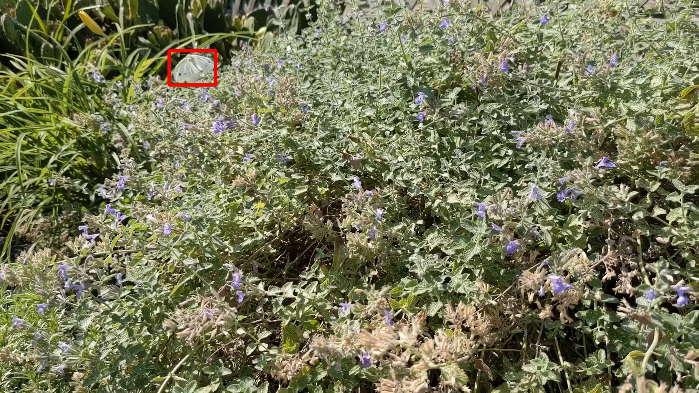

# motion_tracking_CV_bug_detector_2

# Project Overview
This repository contains code for running and training a motion detector for insects in a natural environment. Below is a list of high-level steps outlining the development:
 - OpenCV/NumPy motion tracker
 - Binary ResNet18 image classifier to remove false positives
 - Chip generator for labeling classifier data
 - Retraining script for fine-tuning ResNet18

# Motivation
The impetus for creating this repository/codebase was spurred from my interest in computer vision and its implementation in robotic systems. One example of applied computer vision that piqued my interest was a laserweeding application. In this application, an autonomous system uses computer vision to detect weeds and marks them for removal; thus eliminating the need for harmful herbicides. My interest is to expand on this solution to detect moving targets, such as bugs, and thereby eliminating the need for pesticides.

# Project Details
To Do
main.py = implements a motion tracker 
main_with_video_save.py = a copy of main, with the ability to save frames as a gif
finetune_resnet = alters the ResNet18 architecture into a multiclass or binary classifier (binary in this case) using PyTorch 
utils.py = a collection of functions called multiple times throughout the other files

# Additional Information
The cv2.createBackgroundSubtractorMOG2() function uses the Mixture of Gaussians (MOG2) algorithm to model and update the background of a video sequence. It maintains a statistical model of each pixel's color over time. When a pixel's color significantly deviates from its modeled background, it is considered part of the foreground, allowing the algorithm to detect moving objects in a video by identifying pixels that change over time.
